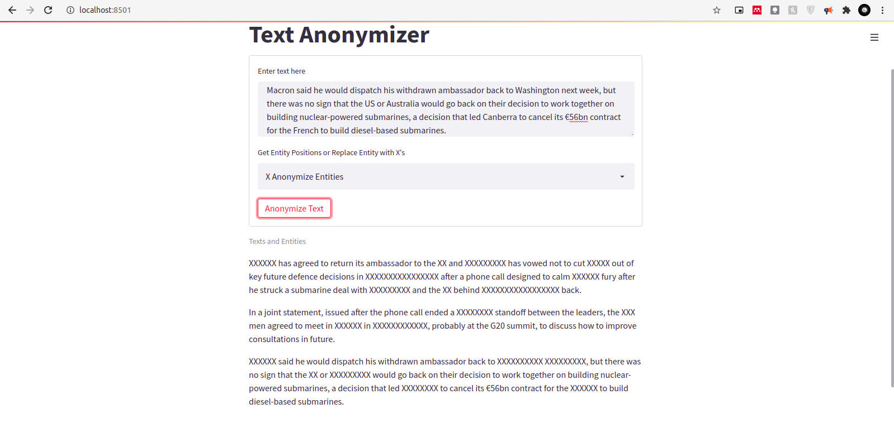
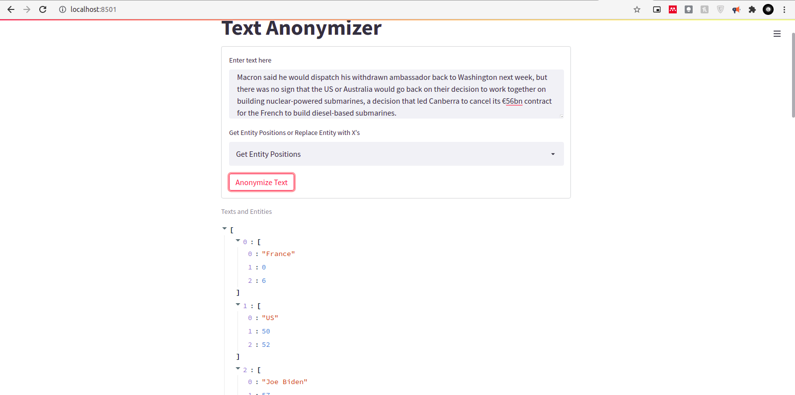

# Text_anonymizer

A webapp and API that anonymize named entities in text

The API can anonymize in 2 ways:

1. Change all named entitied to X's

    This can be used in the API by sending a POST request to

    https://localhost:PORT/get_anonymized/



2. Return text and positions of all named entities

    This can be used in the API by sending a POST request to

    https://localhost:PORT/get_pos/




## API

To setup API Image

```bash
sudo docker build -f ./app/Dockerfile.api .
sudo docker tag <IMAGE ID> text_anonymizer/api
```

To create API Container

```bash
sudo docker run -d --name text_api -p 8000:8000 text_anonymizer/api
```

## WebApp

To start up docker web app image

```bash
sudo docker build -f ./app/Dockerfile.webapp .
sudo docker tag <IMAGE ID> text_anonymizer/app
```

To start up the web app container

```bash
sudo docker run -d --name text_app -p 8501:8501 text_anonymizer/app
```
